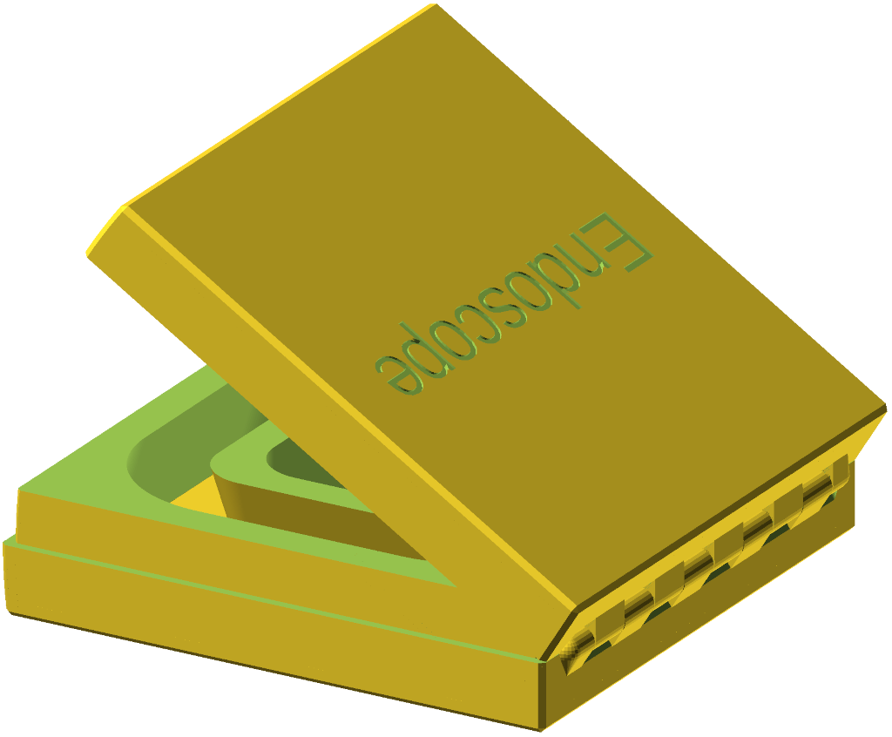
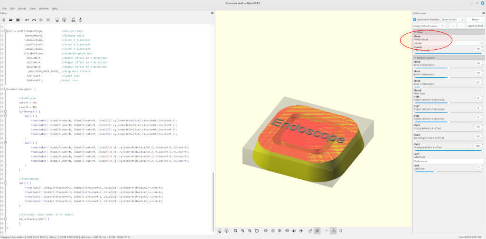
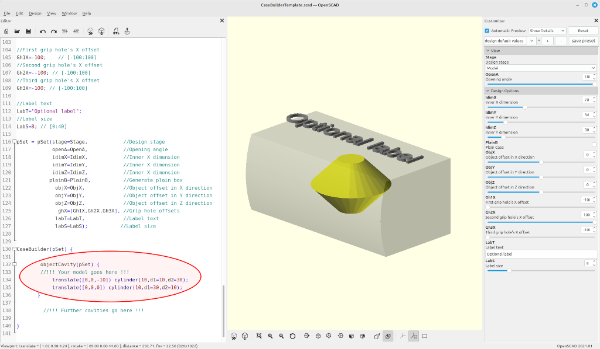
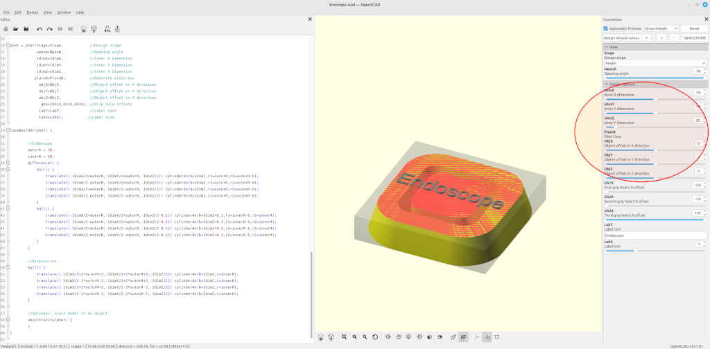
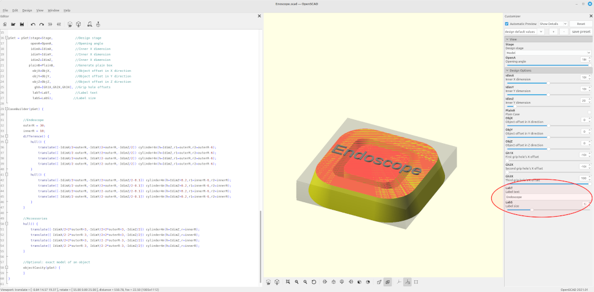
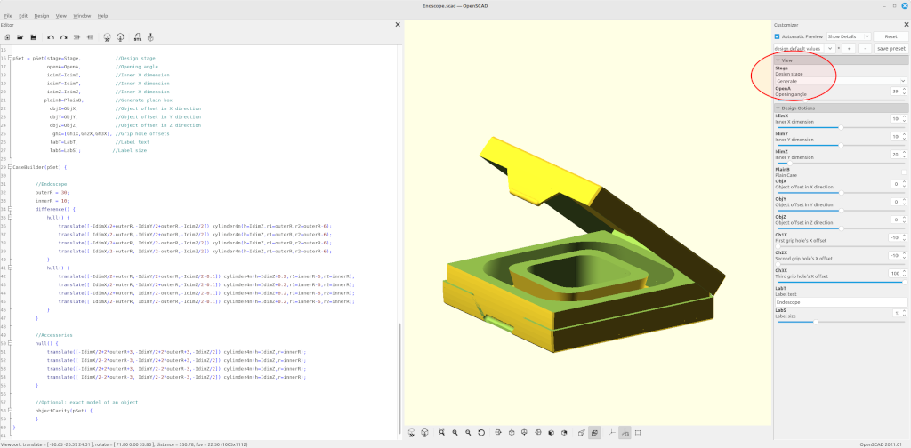
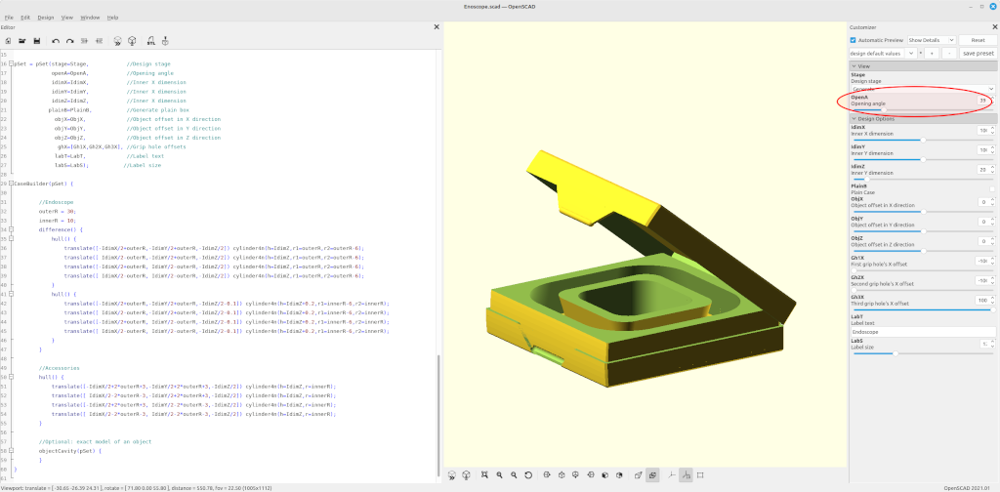
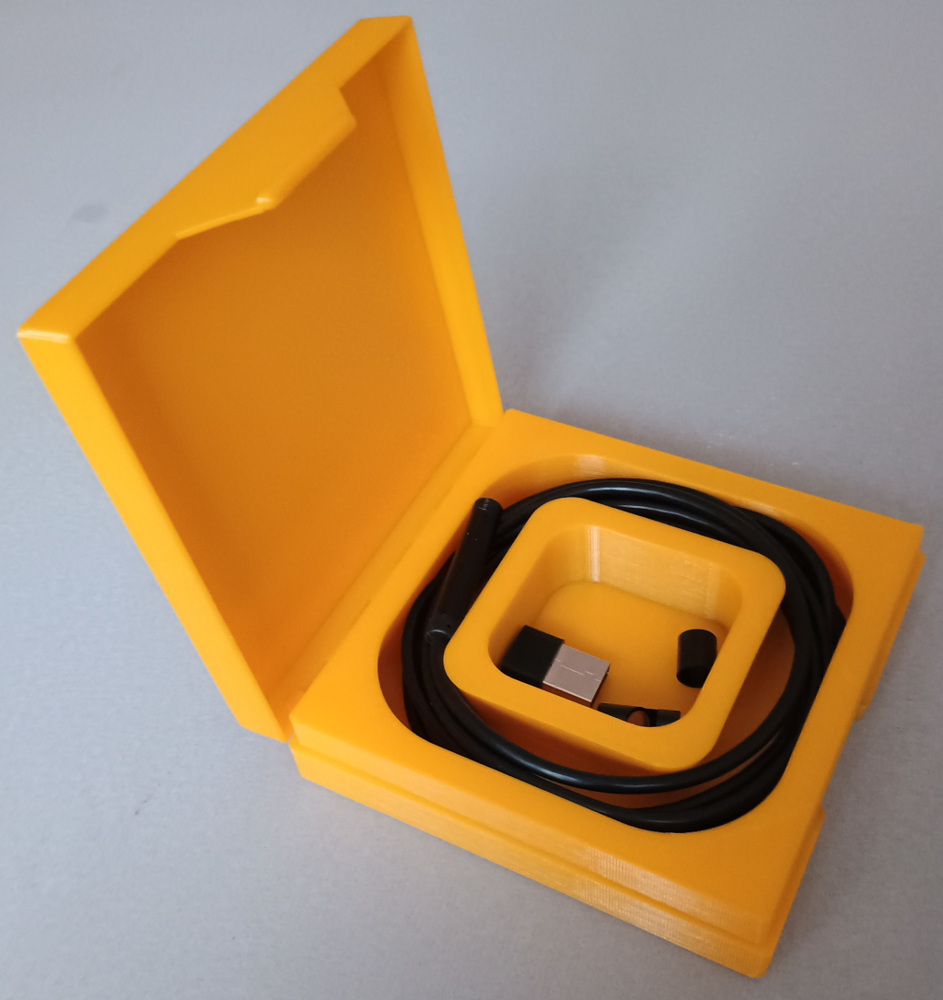

# CaseBuilderLib2
Design 3D printed cases for random things!

 

## How to use this library:

1. **Preparation**
   1. Make a copy of the CaseBuilderLib project template 
      (**CaseBuilderTemplate.scad**).
      The template is intended to be used with the OpenSCAD
      Customizer. 

       

      The design of a customized case is done in two stages.
      Start by setting the **`Stage`** variable to **"Model"** 
      (value = 1). 

      

2. **Model Stage**
   1. The model stages provides a simplified view to design the
      interior of the case. 
      The content of the case must be designed as children of  
      the **`CaseBuilder()`** module. It can be designed in two ways:
         1. It can be an automatically generated cavity around a model
	    the object, that the case in meant to protect. In this case
	    use the **`objectCavity()`** modifier around the object model.

            

	 2. It can be a manually generated cavity. In this case put the
	    shape of the cavity directly insidev the **`CaseBuilder()`**

            

      Alternatively, an empty case can be generated by checking the
      setting the variable **`PlainB`** to true.

      

   2. Configure the inner dimensions of the case by setting the
      **`IdimX`**, **`IdimY`**, and **`IdimZ`** variables.
      If necessary, adjust the position of the content through the
      **`ObjX`**, **`ObjY`**, and **`ObjZ`** variables.

       

   3. If needed, add some grip holes by setting the variables
      **`Gh1X`**, **`Gh2X`**, or **`Gh3X`** to a value within the inner 
      X dimension.
      Further grip holes can be added by manually extending the
      **`ghX`** array within the instantiation of the 
      **`CaseBuilder()`** module.

       

   4. Add an optional label to the case by setting the string
      variable **`LabT`**. The font size can be adjusted through
      the variable **`LabS`**.

       

      Continue by setting the **`Stage`** variable to **"Check"** 
      (value = 2). 

       

3. **Generate stage**
   1. Do a final review of the design.
      Use the **OpenA** variable for a detailed inspection.

       

   2. Render the design and generate a [STL file](https://github.com/hotwolf/CaseBuilderLib/blob/master/Examples/Endoscope/Endoscope.stl).

       

   3. Slice and print.

      

